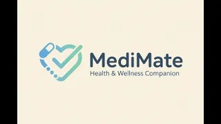

# 🩺 MediMate

  

A privacy-focused medication management and wellness tracking app designed to simplify healthcare routines and improve medication adherence.

Built as a Progressive Web App (PWA), MediMate provides an accessible, lightweight, and easy-to-use experience that works across desktop and mobile devices.

---

## 🚀 Live Demo

🔗 **Website:** https://dbanerjee622.github.io/MediMate/

🎥 **Demo Video:** https://youtu.be/hgWVuW4KA8A

---

## ✨ Features

### 💊 Smart Medication Tracking
- Add medications with dosage and scheduled times
- Automatic chronological sorting
- Mark medications as taken
- Daily reset system for recurring schedules

### 📸 Photo Proof
- Upload medication bottle images
- Visual confirmation for medication adherence
- Images stored locally on the device

### 😊 Wellness Tracking
- Log daily moods and symptoms
- Monitor overall well-being
- Simple and intuitive user interface

### 📄 Clinical Reports
- Generate downloadable PDF reports
- Share medication and wellness history with healthcare providers
- Powered by jsPDF

### 🌙 Accessibility First
- Light Mode and Dark Mode
- High-contrast, readable interface
- Responsive design for all screen sizes

### 📱 Progressive Web App (PWA)
- Install directly to a phone's home screen
- App-like experience without an app store
- Fast and lightweight performance

### 🔒 Privacy Focused
- No accounts required
- No cloud storage
- All user data remains on the device using LocalStorage

---

## 🛠 Tech Stack

- HTML5
- CSS3
- Tailwind CSS
- Vanilla JavaScript
- Web Storage API (LocalStorage)
- Web Notifications API
- FileReader API
- jsPDF
- PWA Manifest

---

## 🎯 Inspiration

Managing medications can quickly become overwhelming, especially for older adults and individuals taking multiple prescriptions. MediMate was created to reduce that complexity by providing a simple, accessible, and privacy-focused solution that helps users stay on top of their health.

---

## ⚙️ How It Works

1. Add medications with dosage and scheduled times.
2. Upload medication images for quick visual reference.
3. Mark medications as taken throughout the day.
4. Track moods and symptoms using the wellness journal.
5. Generate PDF reports for doctor visits.
6. Install the app directly to your device as a PWA.

---

## 🔮 Future Improvements

- Push notification reminders
- Medication interaction warnings
- Caregiver dashboard
- Health analytics and trends
- Secure cloud backup and synchronization

---

## 🏆 Built For

**HackJPS 2026**

---

## 👨‍💻 Developer

**Dhruv Banerjee**

Sophomore high school student passionate about technology, engineering, healthcare innovation, and building solutions that make a real-world impact.

---

## 📜 License

This project was created for educational and hackathon purposes.
